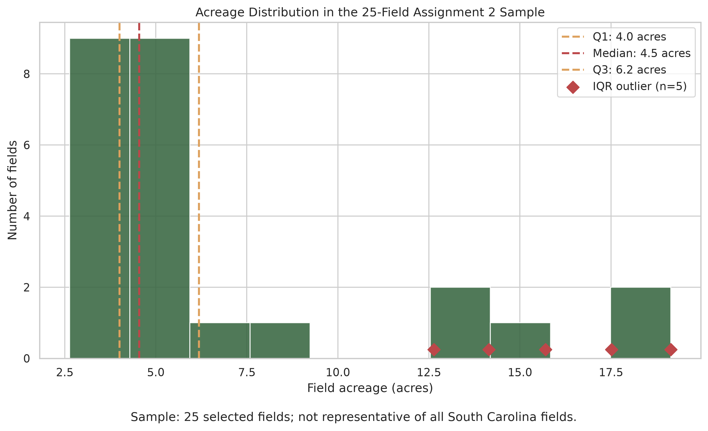
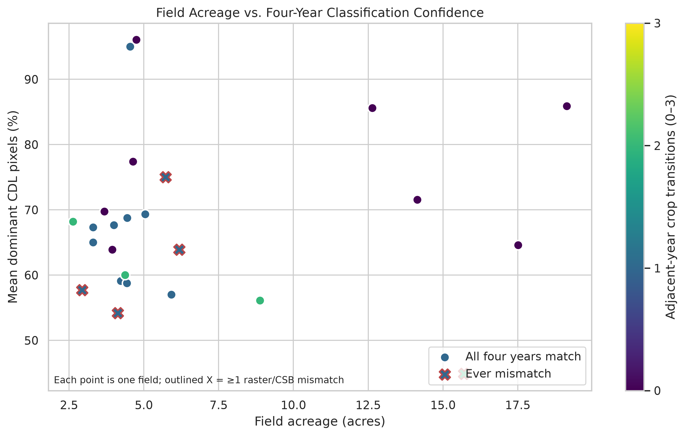
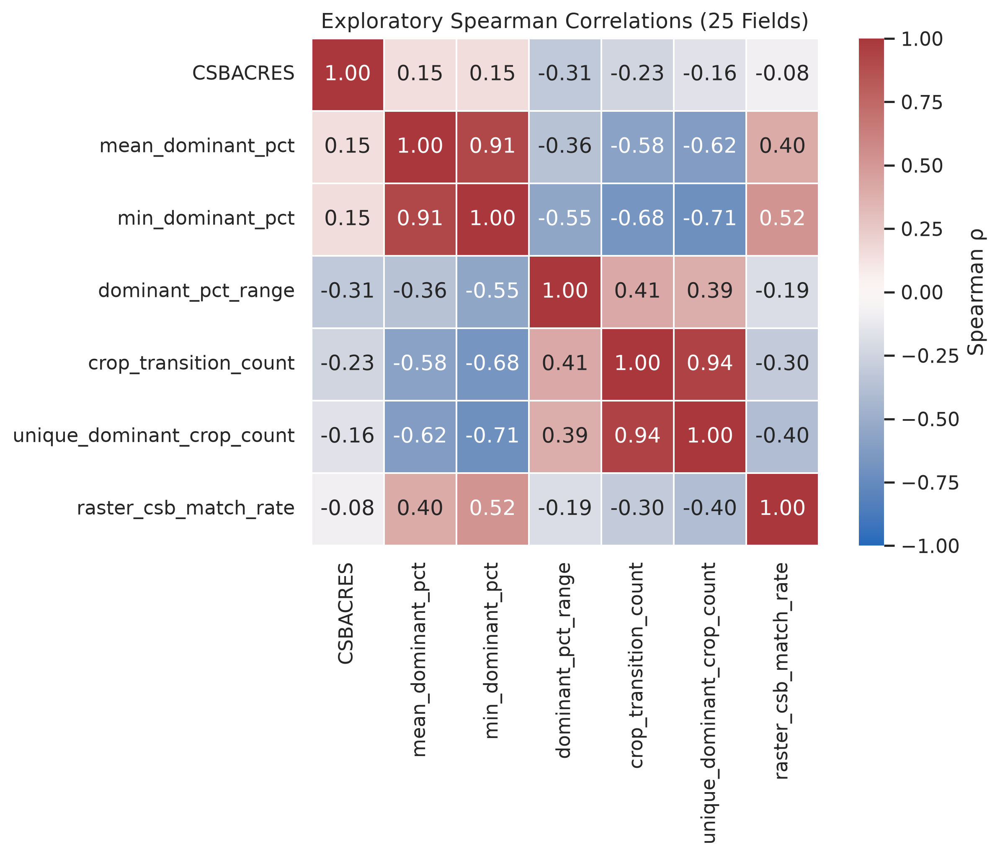
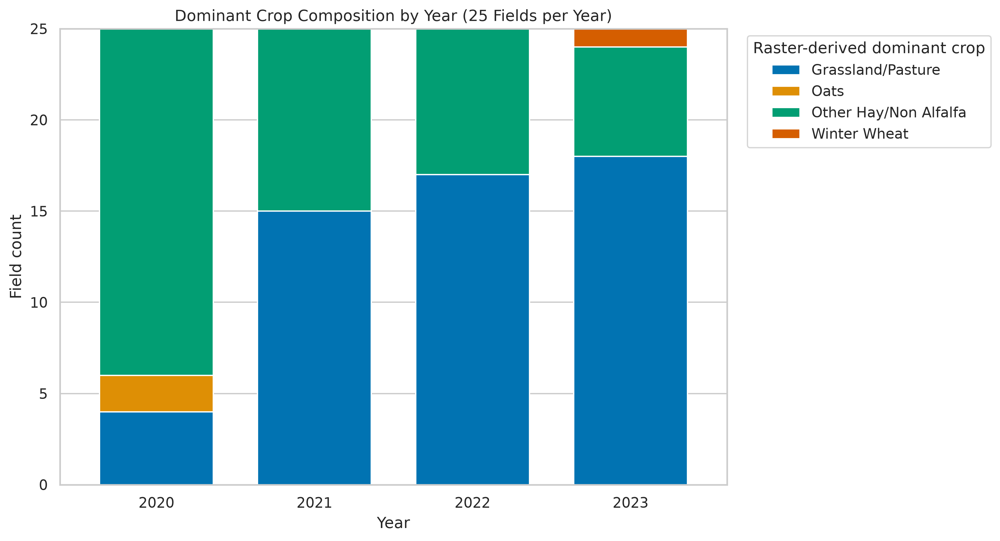

# Assignment 3 EDA Report — Row Crop Fields

## Executive summary

This exploratory analysis uses exactly 25 finalized Assignment 2 fields. Median acreage was **4.55 acres** (range 2.64–19.14), and mean four-year dominant-pixel confidence averaged **68.10%**. Acreage and mean confidence showed little observed association (Spearman ρ = **0.147**, Pearson r = **0.072**, n = 25). Overall raster/CSB agreement was **94.0%** across 100 field-years. Eight fields had no adjacent-year dominant-crop transition, 13 had one, and four had two; none had three.

## Provenance

| Item | Recorded value |
|---|---|
| Authoritative source | `data/assignment-02/field_summary.csv` |
| Source Git commit | `e198d41ba6acf31305a603249361608376c036a0` |
| Source SHA-256 | `5759d566cc88c0646b9579302a047bca6d29a43e1915a046bab3f0471e1637d8` |
| Shape | 25 rows × 30 columns; 25 unique fields |
| Generated UTC | 2026-07-28T15:37:26.885958+00:00 |

USDA provenance is inherited unchanged from Assignment 2: official NASS Crop Sequence Boundaries and official 30 m annual Cropland Data Layer rasters. Detailed source requests and checksums remain in the Assignment 2 summary.

## Dataset description

Available measures are geometry-derived `CSBACRES`; annual crop names and nominal codes; dominant CDL pixel percentages; valid-pixel counts; and raster-versus-CSB agreement flags for 2020–2023. Derived measures summarize confidence, valid pixels, crop transitions, crop-class diversity, and match rates. Identifiers and nominal crop codes were never treated as continuous correlation variables. The table contains no soil, yield, or weather measurements.

## Data quality

- All 25 rows and 25 unique `field_id` values passed validation; each `field_id` equals `CSBID`, all state FIPS values are 45, and no duplicate record exists.
- Acreage and annual valid-pixel counts are positive; annual dominant percentages are within 0–100; crop names are present; match flags normalize losslessly to booleans.
- `source_attribute` is blank for all 25 records. This is source metadata absence, not a reason to discard observations.
- The 1.5×IQR rule flagged five acreage observations and two mean-confidence observations. All satisfy validity rules and were retained; no rows were removed.
- Agreement by year was 92% (2020), 100% (2021), 96% (2022), and 88% (2023), equivalent to 94% overall. A mismatch indicates observed summary disagreement, not an error automatically requiring removal.

## Descriptive statistics

| Metric | Mean | Median | Minimum | Maximum |
|---|---:|---:|---:|---:|
| Acreage (acres) | 6.81 | 4.55 | 2.64 | 19.14 |
| Four-year mean dominant pixels (%) | 68.10 | 67.31 | 44.86 | 96.05 |

| Adjacent-year transitions | Fields | Share |
|---:|---:|---:|
| 0 | 8 | 32% |
| 1 | 13 | 52% |
| 2 | 4 | 16% |
| 3 | 0 | 0% |

## Visual findings

### Figure 1 — Acreage distribution

The distribution is right-skewed within this selected sample; five valid fields exceed the IQR upper fence. The figure describes these **25 fields**, not all South Carolina fields.

### Figure 2 — Acreage versus classification confidence

The field-level cloud shows a weak positive rank association (ρ = 0.147) and near-zero linear association (r = 0.072), n = 25. Markers separately encode transitions and any mismatch. These are descriptive correlations, not causal evidence.

### Figure 3 — Spearman metric correlations

The strongest pair is transition count versus unique dominant-crop count (ρ = 0.939), which is expected because both summarize four-year class variation. Mean and minimum confidence also rank similarly (ρ = 0.915). Correlations from only 25 fields are exploratory and potentially unstable; relationships between mathematically related derived metrics should not be read as independent discoveries.

### Figure 4 — Crop composition by year

Other Hay/Non Alfalfa accounted for 19 of 25 fields in 2020, while Grassland/Pasture accounted for 15, 17, and 18 fields in 2021–2023. Oats appears only in 2020 (two fields) and Winter Wheat only in 2023 (one field). Counts are direct annual classifications; no values are interpolated.

## Dashboard selections

The refined crop-composition asset communicates annual categorical composition with percentage-scaled bars and a stable legend. The refined field-confidence asset preserves all field-level points while separating transitions and mismatch status. Both use wider presentation layouts, accessible colors, explanatory notes, and high-resolution PNG plus scalable SVG exports.

## Limitations

- The sample contains only 25 selected fields, not the assignment-sheet example of 200.
- All fields are from one selected South Carolina county FIPS (45001), limiting geographic generalization.
- Only four annual observations (2020–2023) are available per field.
- CDL raster resolution is 30 m; pixel-center inclusion and possible edge effects matter particularly for small fields.
- Dominant-pixel summarization hides within-field crop-class heterogeneity.
- Every interpretation is exploratory—not causal—and correlation estimates may be unstable.
- Soil, yield, and weather variables are absent, so agronomic relationships involving them cannot be evaluated.

## Data-authenticity statement

No synthetic fields were created, no missing agronomic variables were invented, and no Assignment 2 observations were modified or replaced. All 25 observations originate from finalized Assignment 2 products. Every Assignment 3 metric is a transparent transformation of acreage, annual raster crop class, annual dominant percentage, annual valid pixels, or annual raster/CSB agreement.
