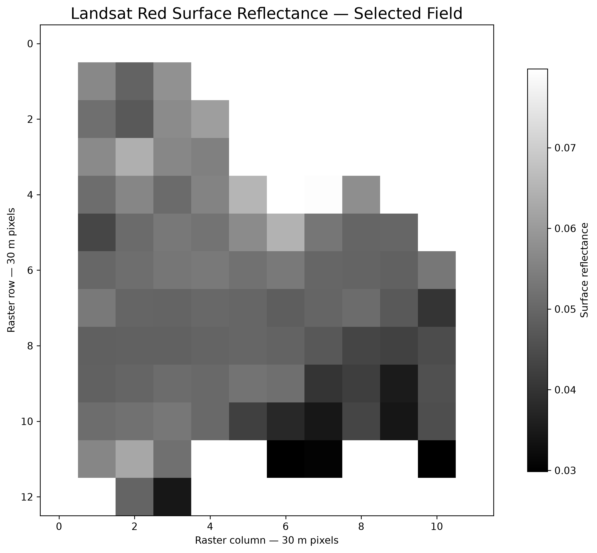
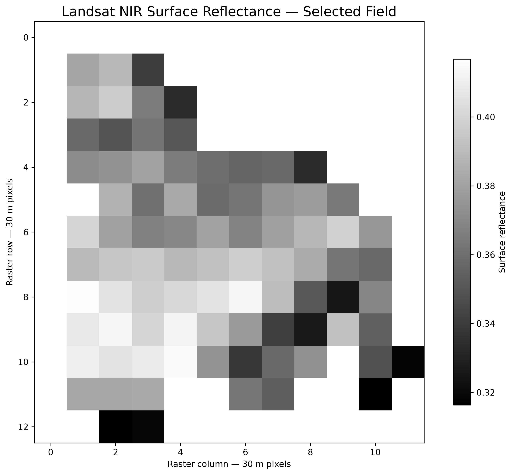
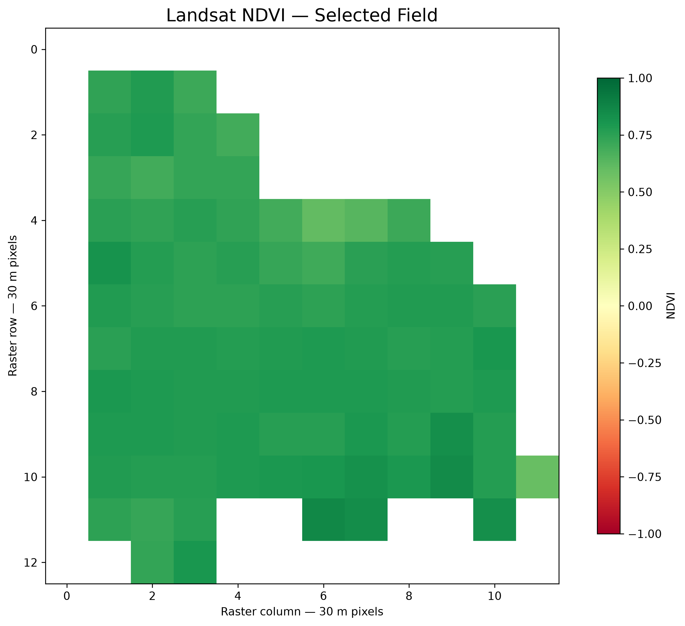
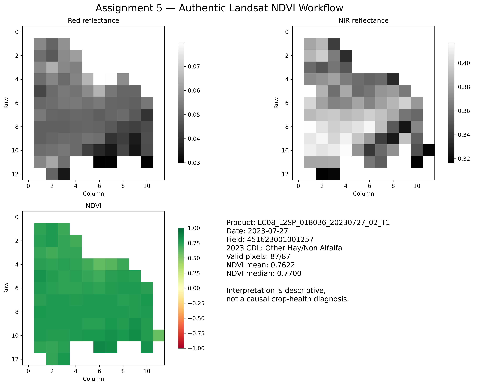

# Assignment 5 NDVI walkthrough

## Objective

Calculate NDVI for an authoritative agricultural field using authentic
Landsat 8 Collection 2 Level-2 surface-reflectance imagery.

## Authoritative field

Field `451623001001257` was selected deterministically as the largest
validated Assignment 2 field. Its validated area is
`19.141194` acres, and its 2023 CDL label is
`Other Hay/Non Alfalfa`.

## Authentic imagery read

The workflow successfully read product `LC08_L2SP_018036_20230727_02_T1`, acquired
on `2023-07-27`, through Microsoft Planetary Computer.

The source data include:

- Red surface reflectance: Landsat `SR_B4`
- Near-infrared surface reflectance: Landsat `SR_B5`
- `QA_PIXEL`
- `QA_RADSAT`

Each locally clipped source raster is recorded with a SHA-256 checksum in
`source/source_manifest.json`.

## Red surface reflectance

## Near-infrared surface reflectance

## Scale, offset, and quality mask

The Red and NIR digital numbers were converted using:

- Scale: `2.75e-05`
- Offset: `-0.2`

The mask rejects fill, dilated cloud, cirrus, cloud, cloud shadow, snow,
radiometric saturation, source fill/nodata, nonfinite or negative
reflectance, near-zero denominators, and pixels outside the field.

## NDVI calculation

`NDVI = (NIR - Red) / (NIR + Red)`

## Results

The field contained `87` valid 30 m NDVI pixels.

| Statistic | NDVI |
|---|---:|
| Minimum | 0.5935 |
| Median | 0.7700 |
| Mean | 0.7622 |
| Maximum | 0.8612 |
| Standard deviation | 0.0432 |

The median and mean indicate **high greenness** on
`2023-07-27`.

## Interpretation and limitations

This is a descriptive single-date result at 30 m spatial resolution. The
field contains relatively few Landsat pixels, and edge pixels may contain
mixed reflectance from the field and surrounding land cover. NDVI alone
cannot identify a specific stressor or establish crop health, yield, or
management performance.

## Reproducibility

The executed notebook is located at
`../../notebooks/05_ndvi_crop_health.ipynb`. The independent verifier checks
source and output checksums, raster alignment, NDVI statistics, image
dimensions, notebook execution, and the no-synthetic-data attestations.
