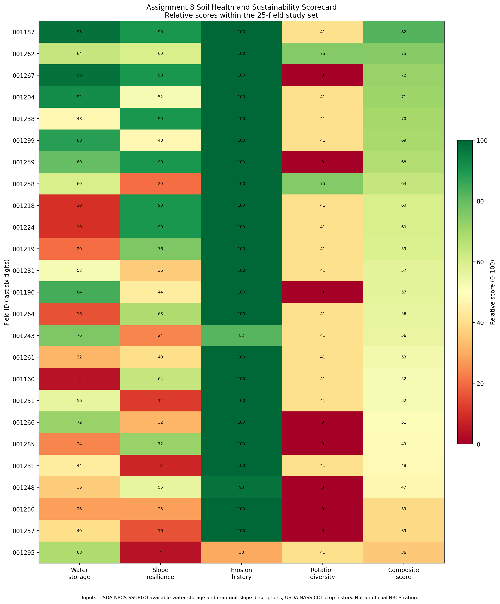
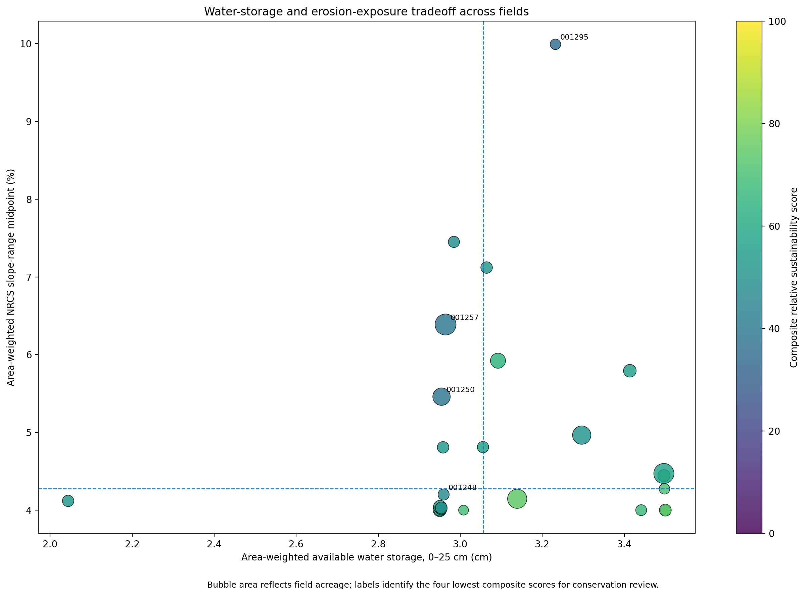

# Assignment 8 Soil Health and Sustainability Assessment

## Completion status

**Complete.** The analysis evaluates 25 authoritative row-crop fields using committed USDA-NRCS SSURGO intersections and four-year USDA NASS CDL crop history. No synthetic, substituted, or inferred laboratory observations are used.

## Required sustainability metrics

1. **Available-water-storage score:** area-weighted NRCS `aws025wta` for 0–25 cm.
2. **Slope-resilience score:** inverse relative rank of area-weighted NRCS slope-range midpoints.
3. **Erosion-history score:** 100 minus field percentage in map units whose NRCS name includes “eroded.”
4. **Crop-rotation diversity score:** normalized Shannon diversity of the 2020–2023 CDL sequence.

The composite is their equal-weight mean. It is a relative decision-support index for these 25 fields, not an official NRCS soil-health rating.

## Main findings

- Highest relative score: field `451623001001187` (82.1/100).
- Highest conservation-priority signal: field `451623001001295` (35.5/100).
- SSURGO map units represented: 8.
- Dashboard visualizations delivered: 2.

## Soil variability visualization

## Sustainability tradeoff visualization

## Interpretation

Higher water storage, gentler mapped slopes, less mapped eroded-soil area, and more diverse four-year crop histories produce higher relative scores. Low scores identify candidates for inspection, soil testing, erosion assessment, and conservation planning—not automatic diagnoses.

## Data limitations

- The package does not contain field-level laboratory pH, organic matter, soil carbon, biological activity, aggregate stability, infiltration, or direct soil-moisture observations; none are invented.
- SSURGO values and map-unit names describe mapped soil components and are not substitutes for field sampling.
- Slope midpoint is parsed from the published NRCS map-unit name and area-weighted by field overlap.
- The eroded-mapunit metric depends on the map-unit name containing the word 'eroded'; absence of that descriptor does not demonstrate absence of present-day erosion.
- CDL crop classes can contain classification error and are used only as a four-year management-diversity indicator.
- All 0–100 scores are relative within this 25-field dataset and are not official NRCS or Soil Health Institute ratings.
